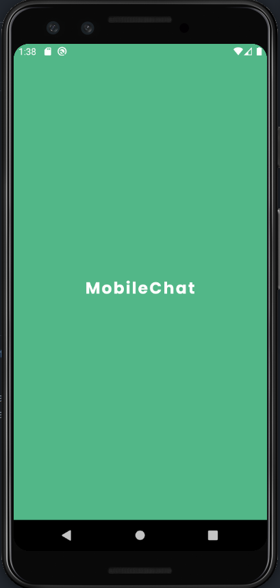

# :iphone: MobileChat

## About The Project

> App's loading screen

The entire idea behind this project it's better understanding of the used technologies and incrementing my own portfolio.

### Built With

* [React Native](https://reactnative.dev/)
* [Vector Icons](https://github.com/oblador/react-native-vector-icons)
* [Reanimated](https://docs.swmansion.com/react-native-reanimated/)
* [MongoDB](https://www.mongodb.com/)

## Roadmap

Check the roadmap on my [notion's page](https://wheat-titanium-222.notion.site/da0f3111f73449b38ac5bb2b99a9f49e?v=0567e8f918eb4ad29c866ffaf9ebcae3)